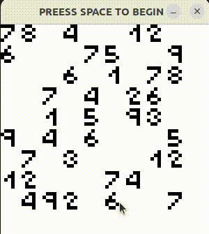

# sudoku solver app

Solves sudoku using backtracking/backtracing algorithm. It is deliberately slowed down to display the working of the algorithm. You can press space bar to perform one step or hold it to run the algorithm.

the playback might be a little choppy because it was recorded on a VM.

Has GUI made using SFMF. The solver and the GUI are run on separate threads.

This app is made with:
[Neils Lohmann's JSON library](https://github.com/nlohmann/json)
[Andrew King's SFML boilerplate](https://github.com/rewrking)
[SFML](https://www.sfml-dev.org/)
